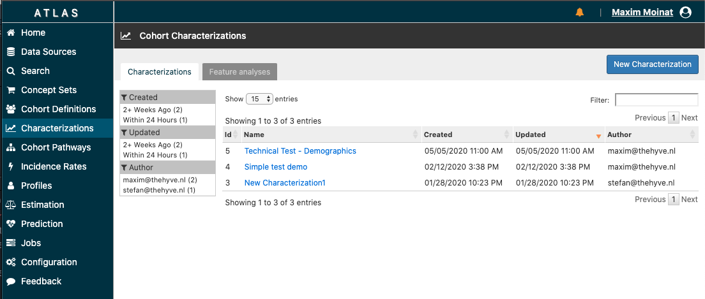
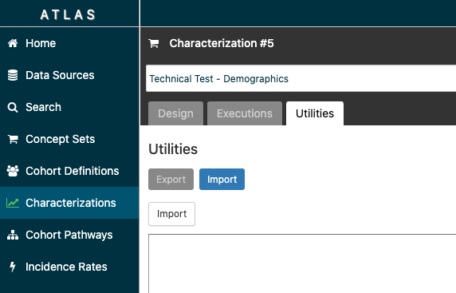

# Technical Tests for PIONEER hackathon
The scripts in this folder contain simple analyses for federated data sources.
Three functionalities can be tested: 

- Running a simple stand-alone sql query via a sql client (e.g. pgAdmin or MS SQL Server Management Studio)
- Loading a definition in the local Atlas installation.
- Running a query in R, connecting to the database using the [OHDSI methods library](https://ohdsi.github.io/MethodsLibrary/).

## SQL Query

1. Open `count_males.sql` in your sql client of choice.
2. If needed, add schema reference where an OMOP person table can be found. (e.g. `cdm5.person`).
3. Run the query. It should return a single count of all males born before 1970.

## Atlas
We will create and run a cohort characterization in Atlas.

1. Navigate to Atlas using your browser of choice (preferably Chrome).
2. Click on 'Characterizations' in the left menu.
3. Click 'New Characterization'

4. Go to the 'Utilities' tab, then 'Import'. An empty text box should show. 
5. Open `cohort_characterization.json`, copy the contents, and paste them in the text box.
6. Click 'Import', the characterization study should load with one target cohort and four feature analyses.
7. Go to the 'Executions' tab and press 'Generate' for one of the configured datasets. After a short wait, the results should be ready and can be viewed through 'View latest result'

## R
The R script (`run_cohort_definition_query.R`) will render, translate and execute a simple cohort definition (`cohort_definition.sql`, persons with 'Neoplasm of prostate').

1. Open the R file in Rstudio or Jupyter, form which a connection to the OHDSI database is possible.
2. Replace the connection details and the schema names on lines 7-19.
3. Run the whole script. The first command installs the `DatabaseConnector` package (including `SqlRender`) from the OHDSI methods library.
4. The last command should display the persons in the just created cohort.